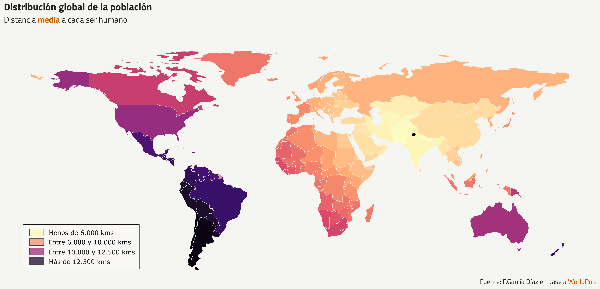
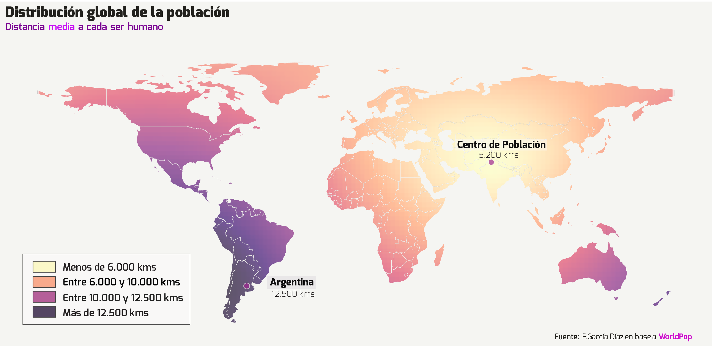

<!-- README.md is generated from README.Rmd. Please edit that file -->

```{r, include = FALSE}
knitr::opts_chunk$set(
  collapse = TRUE,
  comment = "#>"
)
```

# 1 Centro de población global

El script genera la distancia de cada punto de la tierra al centro de población global, 
o equivalentemente, la distancia media de cada punto de la tierra a cada persona. 

# 2 Versión discreta



# 3 Versión continua


